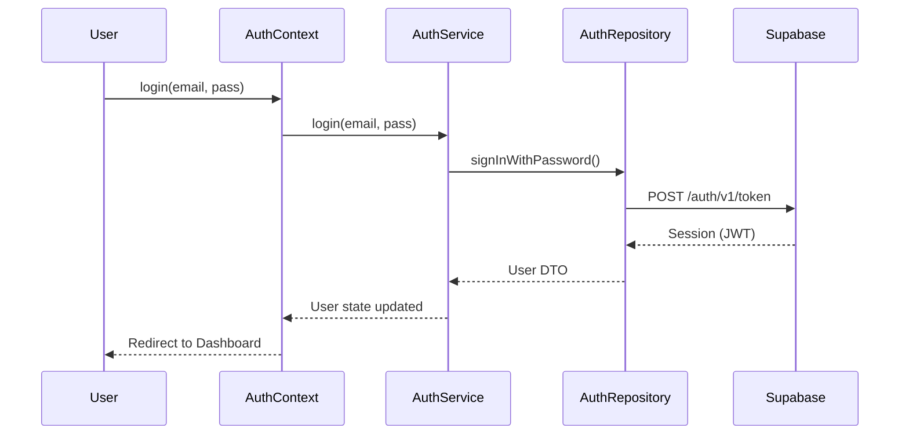
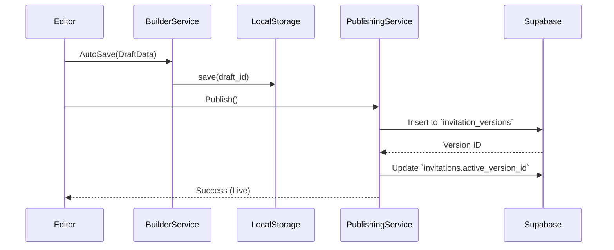
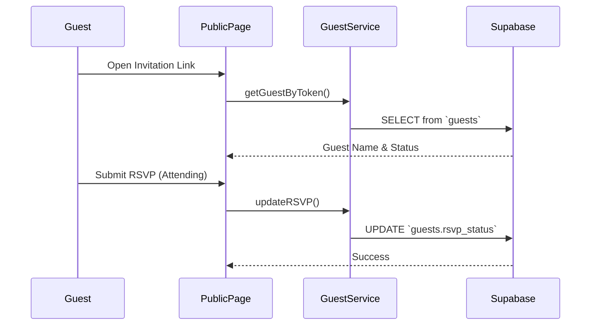
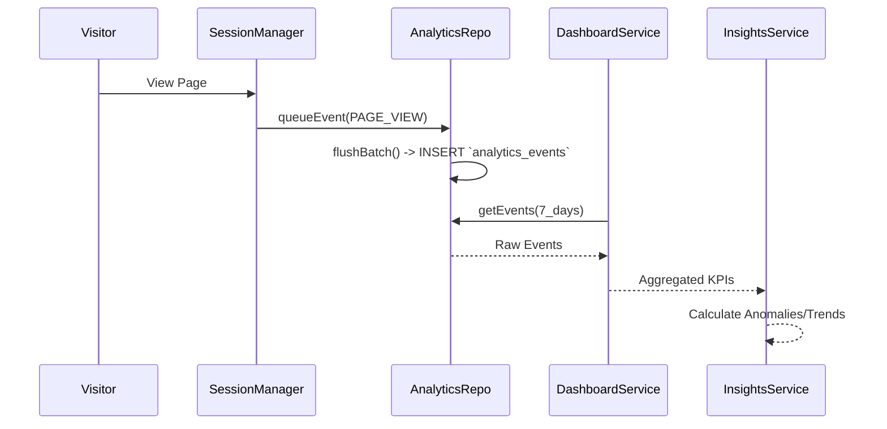
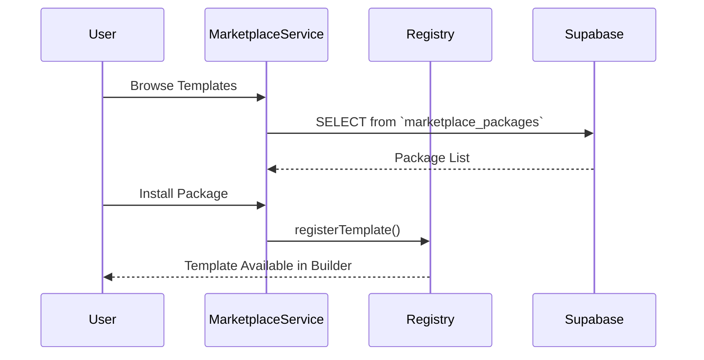

# Project Architecture Overview

## 1. Core Architectural Paradigm

The Antigravity Wedding Invitation Platform strictly adheres to **Clean Architecture** principles, enforcing a unidirectional data flow and strict layer boundaries.

### Layer Hierarchy

1. **Presentation Layer (`src/components/`, `src/hooks/`)**
   - Contains React Components and custom UI hooks.
   - Responsible strictly for rendering data and capturing user events.
   - **Constraint**: Cannot access the Database or perform complex business calculations.

2. **Application Layer (`src/features/*/service.ts`)**
   - The Service Layer orchestrates domain logic.
   - Receives commands from the Presentation layer and coordinates data retrieval/saving.
   - **Constraint**: Cannot contain React logic. Returns pure JSON-serializable DTOs.

3. **Domain Layer (`src/features/*/types.ts`, `schema.ts`, `src/lib/`)**
   - Contains pure business rules, Zod validation schemas, and mathematical engines (e.g., `kpi-engine`, `report-builder`).
   - Completely agnostic to the database or UI.

4. **Repository Layer (`src/features/*/repository.ts`)**
   - The isolated Data Access Layer.
   - Encapsulates all `supabase.from()` interactions.
   - Maps raw database rows to Domain objects.

5. **Infrastructure Layer (`supabase/`)**
   - Postgres Database, Storage Buckets, and GoTrue Authentication.

---

## 2. Key System Flows

### Authentication Flow

### Builder Flow (Drafting to Live)

### Guest Management & RSVP Flow

### Analytics Flow

### Marketplace Flow

---

## 3. The Repository Pattern Strategy

By decoupling the UI from the Database, we achieved:
- **Testability**: Services can be tested by mocking Repositories.
- **Maintainability**: If Supabase changes its API, only the Repository files change.
- **Reusability**: `ReportRepository` and `InsightsRepository` safely reuse `DashboardRepository` without duplicating SQL queries.
